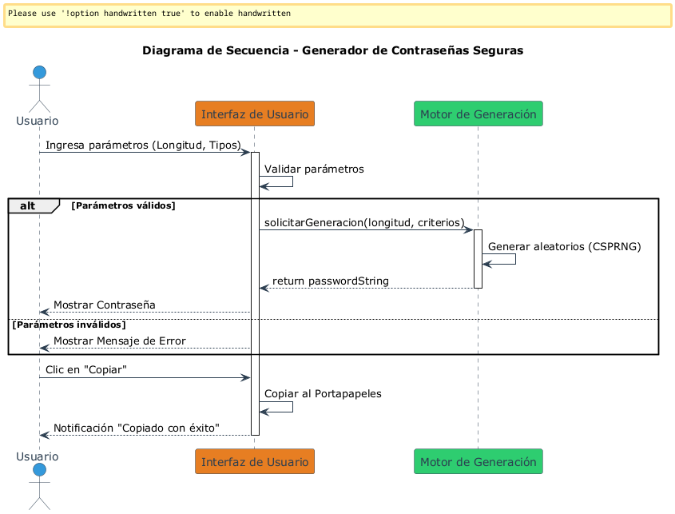
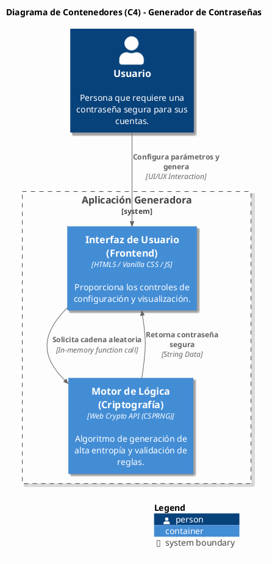

# Informe Técnico: Generador Seguro de Contraseñas
## Materia: Lógica de Programación
## Metodología: Resolución de Problemas

---

## 1. Análisis del Problema

### Definición del Problema
El problema radica en la vulnerabilidad de las cuentas digitales debido al uso de contraseñas débiles o repetidas. Se requiere una herramienta que genere cadenas de caracteres aleatorias con alta entropía y seguridad que le permitirá a los usuarios crear contraseñas seguras y robustas.

### Variables de Entrada
- **Longitud (L)**: Cantidad total de caracteres (mínimo recomendado: 12).
- **Criterios (C)**: Conjunto de booleanos para Mayúsculas, Minúsculas, Números y Símbolos.

### Procesos Clave
1. **Validación**: Asegurar que L > 8 y al menos un criterio en C sea verdadero.
2. **Construcción del Conjunto de Caracteres**: Concatenación de los grupos seleccionados.
3. **Generación Aleatoria Criptográfica**: Uso de CSPRNG (Cryptographically Secure Pseudo-Random Number Generator) para evitar predictibilidad.
4. **Garantía de Diversidad**: Asegurar la presencia de al menos un carácter por cada tipo elegido.
5. **Cálculo de Fortaleza**: Evaluación de la dificultad de descifrar la contraseña.
6. **Garantía de Aleatoriedad**: Asegurar que una misma contraseña no se repita en ejecuciones sucesivas.

### Salidas
- **Contraseña**: Cadena de texto resultante.
- **Feedback**: Nivel de seguridad (fortaleza) y confirmación de copiado.

---

## 2. Diseño de la Solución

### Técnicas de Representación y Justificación

Para garantizar un diseño robusto y comprensible, se seleccionaron dos tipos de diagramas específicos que modelan diferentes perspectivas del sistema:

#### 1. Diagrama de Secuencia (UML)
* **Por qué se usó**: Es la herramienta idónea para ilustrar detalladamente la interacción temporal y secuencial entre el usuario y las capas internas del sistema. Permite comprender el flujo exacto de mensajes desde que el usuario define los parámetros en la UI, pasando por las validaciones lógicas, hasta que el motor de criptografía genera y devuelve la contraseña segura en la línea del tiempo.

#### 2. Modelo C4 - Diagrama de Contenedores
* **Por qué se usó**: Permite visualizar a nivel arquitectónico cómo se estructuran y distribuyen las responsabilidades del software. A través de este modelo se demuestra de manera clara y sencilla que la aplicación opera en su totalidad dentro del navegador del usuario (lado del cliente) acoplando el Frontend con la API de Criptografía local, sin involucrar servidores de Backend ni bases de datos remotas.

---

## 3. Implementación (Referencia de la Interfaz)

Para la futura construcción del sistema, se plantea el diseño de una interfaz gráfica que actúe como canal interactivo para que cualquier usuario pueda parametrizar y generar sus contraseñas. 

A continuación, se presenta un mockup de la interfaz propuesto como referencia visual para el desarrollo del proyecto:

### Propuesta de Interfaz de Usuario

---

## 4. Revisión

### Verificación de Correctitud
La validación de la solución se realiza mediante las siguientes capas de pruebas:
1. **Pruebas de Límite**: Se verifica que el programa maneje correctamente rangos de longitud (8-64 caracteres).
2. **Validación Lógica**: Uso de expresiones regulares para confirmar que la salida cumple estrictamente con los tipos seleccionados.
3. **Auditoría de Seguridad**: Verificación del uso de funciones criptográficas resistentes al criptoanálisis.
4. **Verificar Aleatoriedad**: Verificar que la salida no se repite en varias ejecuciones sucesivas.

### Análisis de Fortaleza (Nivel de Seguridad)
Para entender qué tan segura es la contraseña generada, imaginemos a una supercomputadora intentando adivinarla probando todas las combinaciones posibles. Una contraseña de 12 caracteres creada con esta herramienta es tan compleja que le tomaría a esa computadora **miles de años** descifrarla. Esto garantiza que tus cuentas estén protegidas incluso ante los ataques más potentes y modernos.
